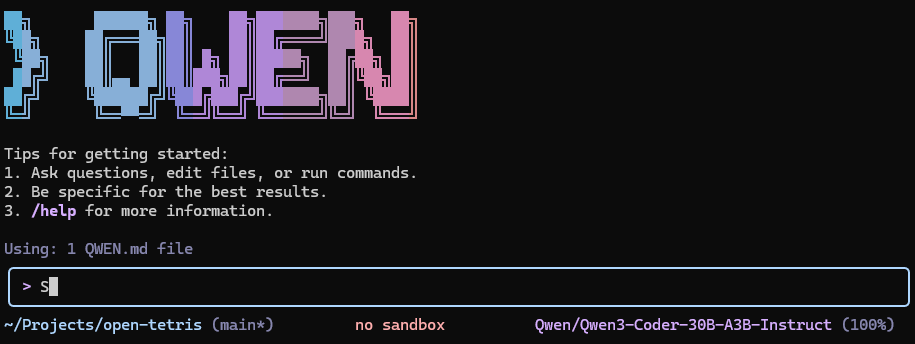
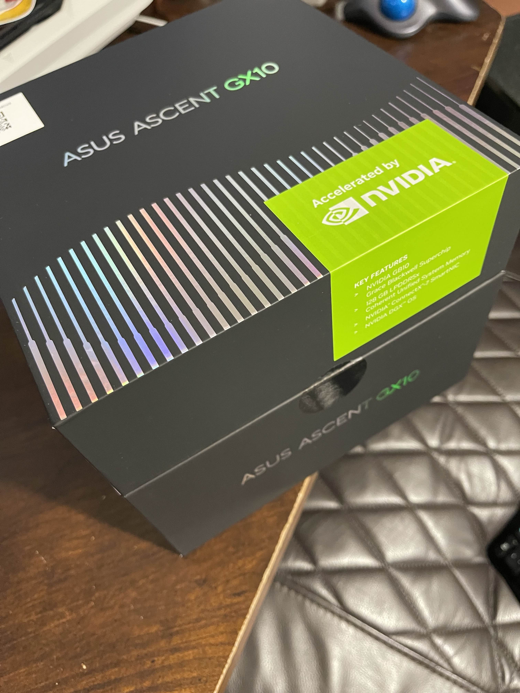
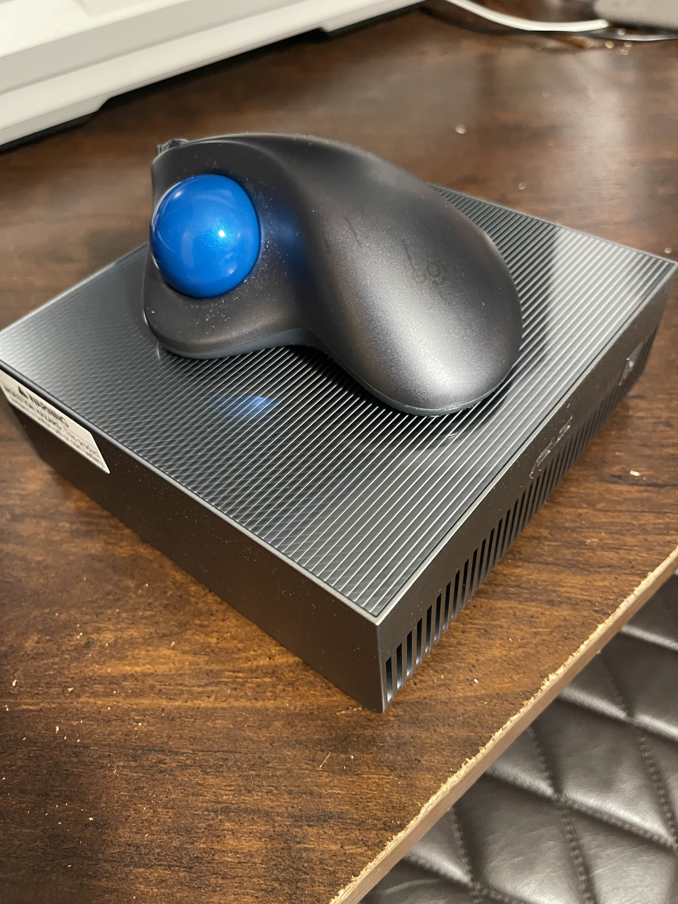

# Open Tetris

A fully-functional web-based Tetris game built entirely with AI assistance using Qwen Code running on an NVIDIA DGX Spark.

## Try The Game Live!
🎮 [https://open-tetris.toobusyforai.com/](https://open-tetris.toobusyforai.com/)
```
🎮 https://open-tetris.toobusyforai.com/
```

## About This Project

*Qwen Code powered by vLLM + Qwen3-Coder-30B-A3B-Instruct*

This project was created as a demonstration of AI-assisted code generation using **two prompts** to [Qwen Code](https://github.com/QwenLM/qwen-code), powered by:

- **ASUS Ascent GX10 (NVIDIA DGX Spark)** [hardware](https://www.asus.com/networking-iot-servers/desktop-ai-supercomputer/ultra-small-ai-supercomputers/asus-ascent-gx10/)
- **[vLLM](https://docs.vllm.ai/en/latest/)** inference engine
- **Qwen3-Coder-30B-A3B-Instruct** [model](https://huggingface.co/Qwen/Qwen3-Coder-30B-A3B-Instruct)

The entire application, including the game logic, server setup, and Docker configuration, was generated through AI assistance, showcasing the capabilities of modern code generation models.

## Features

- Classic Tetris gameplay with all standard tetromino shapes (I, T, L, J, O, S, Z)
- Smooth piece rotation and collision detection
- Line clearing and score tracking
- Keyboard controls with arrow keys
- Hard drop functionality (spacebar)
- Pause/Resume capability
- Responsive canvas-based rendering
- Clean, minimal UI
- Mobile touch controls for on-the-go gameplay

## Game Controls

### Desktop Controls
| Key | Action |
|-----|--------|
| **Left Arrow** | Move piece left |
| **Right Arrow** | Move piece right |
| **Down Arrow** | Soft drop (move down faster) |
| **Up Arrow** | Rotate piece clockwise |
| **Spacebar** | Hard drop (instant placement) |
| **P** | Pause/Resume game |

### Mobile Controls
On mobile devices, touch controls appear at the bottom of the screen:
- **Directional Pad**: Move piece left/right/down
- **Rotate Button**: Rotate piece clockwise
- **Hard Drop Button**: Instantly drop piece

## Tech Stack

- **Frontend**: HTML5 Canvas, Vanilla JavaScript
- **Backend**: Node.js with Express
- **Containerization**: Docker and Docker Compose
- **Runtime**: Node.js 18 (Alpine Linux)

## Installation & Usage

### Option 1: Run with Docker Compose (Recommended)

```bash
docker-compose up -d --build
```

The game will be available at `http://localhost:8081`

### Option 2: Run with Docker

```bash
docker build -t open-tetris .
docker run -p 8081:3000 open-tetris
```

The game will be available at `http://localhost:8081`

### Option 3: Run Locally

1. Install dependencies:
```bash
npm install
```

2. Start the server:
```bash
npm start
```

3. Open your browser and navigate to `http://localhost:3000`

### Development Mode

For development with auto-reload:

```bash
npm run dev
```

## Project Structure

```
gh-open-tetris/
├── public/
│   └── index.html          # Main game file (HTML/CSS/JS)
├── server.js               # Express server
├── package.json            # Node.js dependencies
├── Dockerfile              # Docker image configuration
├── docker-compose.yml      # Docker Compose configuration
├── .dockerignore          # Docker ignore file
└── README.md              # This file
```

## How It Works

The game uses HTML5 Canvas for rendering and implements classic Tetris mechanics:

1. **Game Board**: A 10x20 grid where pieces fall
2. **Tetrominoes**: Seven unique shapes with distinct colors
3. **Game Loop**: RequestAnimationFrame for smooth rendering
4. **Collision Detection**: Checks for boundary and piece collisions
5. **Line Clearing**: Removes completed rows and updates score
6. **Score System**: 100 points per line cleared

## Built with AI



*The NVIDIA DGX Spark that powered this project*

This entire project demonstrates the power of modern AI code generation. With just two carefully crafted prompts, Qwen Code generated:

- Complete game logic with physics and collision detection
- Full Express.js server setup
- Docker containerization configuration
- Professional code structure and organization

The model used was **Qwen3-Coder-30B-A3B-Instruct**, running on vLLM for optimized inference on the NVIDIA DGX Spark platform.

## License

This project is open source and available for educational and demonstration purposes.

## Acknowledgments

- Generated with **Qwen Code** (Qwen3-Coder-30B-A3B-Instruct)
- Powered by **NVIDIA DGX Spark** and **vLLM**
- Built as a demonstration of AI-assisted software development

## FAQs
1. **Why Tetris?**  It seems to be the thing people do to test out agentic AI coding abilities [Online Search](https://www.google.com/search?q=agentic+ai+test+to+make+tetris+game)

2. **Why Qwen Code?**  I got tired of running out of tokens with Claude Code.  Plus I am always on the lookout for new useful tools.

3. **Why vLLM? (instead of ollama)**  Many documentations online on why vLLM is great for serving inference for production use cases.  But essentially - I wanted to run a HuggingFace model.

4. **Why Qwen3-Coder-30B-A3B-Instruct?**  I don't recall where I read it from, but I considered multiple models before deciding this might be the best* I can use with my hardware at this time.  If you have other suggestions, I'm all ears!

5. **Why Asus Ascent GX10 / Nvidia DGX Spark?**  I got tired of being limited to my 4090 Ti and wanted something that can run bigger models without having to spend $20k.  I did read that the performance is slower* than fully dedicated GPUs, but for my use cases, the ability to try larger models is more important than latency at this time.

6. **Why Docker?**  This is likely not a question for most people but still: I prefer containerized environments.  Also makes deployment basically foolproof.

7. **What was the biggest challenge?**  The biggest challenge was getting Qwen to return tool calling properly from vllm.  This wasn't clear at first, but various experimentation with model cards and online searches later, this worked:
```bash
vllm serve Qwen/Qwen3-Coder-30B-A3B-Instruct --enable-auto-tool-choice --tool-call-parser qwen3-coder
```

---

*This README was (mostly) written by [Claude Code](https://claude.com/claude-code); Why? Because I like Claude's documentation approaches*